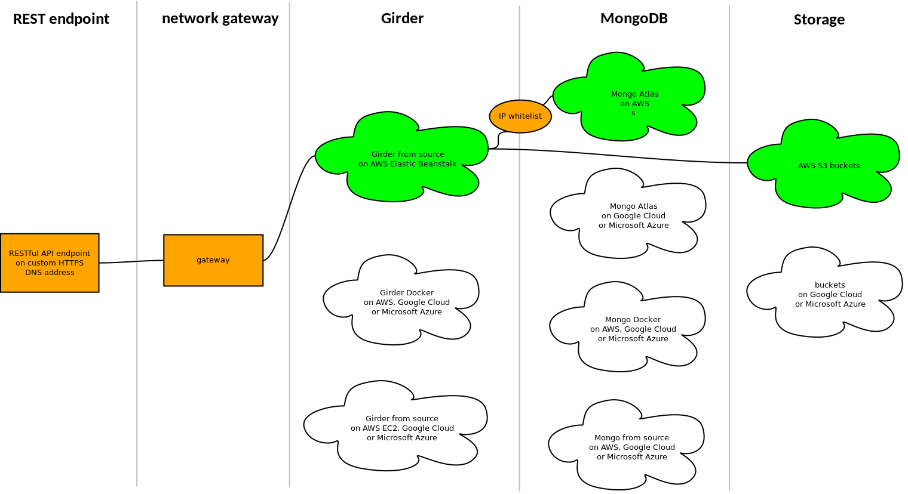

# Mindlogger Backend
This repository documents setup and management of Mindlogger's Girder API backend.

## Network Diagram
In the following diagram, the filled components represent our current setup. The unfilled components that share a lane with a component we are using are interchangeable alternatives.

([Dia](http://live.gnome.org/Dia)-formatted diagram source file: [`assets/img/network.dia`](assets/img/network.dia))

## Mindlogger Girder DB Interactive Endpoint (Live Link)
[🔗 Mindlogger Girder Database](http://mindlogger-girder-atlas.a4vwd5q7ib.us-east-1.elasticbeanstalk.com)
